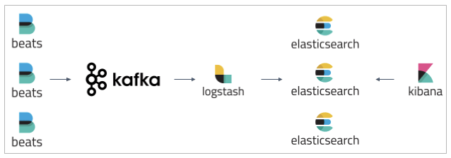

# elk-kafka


ELK Stack with Apache Kafka as buffer.


## Resources available
- [elk-sample](https://github.com/aleroxac/elk-sample) files(with some changes)
- filebeat
- apache kafka
- apache zookeeper


## Setup
``` shell
## Installing Docker
curl -fsSL https://get.docker.com | bash

### Installing docker-compose
sudo curl -L "https://github.com/docker/compose/releases/download/1.27.4/docker-compose-$(uname -s)-$(uname -m)" -o /usr/local/bin/docker-compose
sudo chmod +x /usr/local/bin/docker-compose
```


## Use mode
``` sh
## Running the docker-compose
docker-compose up -d

### Viewing messages inside kafka 
docker-compose exec kafka bash -c 'watch -n1 kafka-consumer-groups --bootstrap-server localhost:9092 --group logstash --describe'

### Restarting index process
assets/scripts/restart apache

### Creating Kibana index-pattern
curl 'http://localhost:5601/api/saved_objects/index-pattern' \
  -H 'kbn-version: 7.10.0' \
  -H 'Content-Type: application/json' \
  --data-raw '{"attributes":{"title":"apache*","timeFieldName":"@timestamp","fields":"[{\"count\":0,\"name\":\"@timestamp\",\"type\":\"date\",\"esTypes\":[\"date\"],\"scripted\":false,\"searchable\":true,\"aggregatable\":true,\"readFromDocValues\":true},{\"count\":0,\"name\":\"@version\",\"type\":\"string\",\"esTypes\":[\"text\"],\"scripted\":false,\"searchable\":true,\"aggregatable\":false,\"readFromDocValues\":false},{\"count\":0,\"name\":\"@version.keyword\",\"type\":\"string\",\"esTypes\":[\"keyword\"],\"scripted\":false,\"searchable\":true,\"aggregatable\":true,\"readFromDocValues\":true,\"subType\":{\"multi\":{\"parent\":\"@version\"}}},{\"count\":0,\"name\":\"_id\",\"type\":\"string\",\"esTypes\":[\"_id\"],\"scripted\":false,\"searchable\":true,\"aggregatable\":true,\"readFromDocValues\":false},{\"count\":0,\"name\":\"_index\",\"type\":\"string\",\"esTypes\":[\"_index\"],\"scripted\":false,\"searchable\":true,\"aggregatable\":true,\"readFromDocValues\":false},{\"count\":0,\"name\":\"_score\",\"type\":\"number\",\"scripted\":false,\"searchable\":false,\"aggregatable\":false,\"readFromDocValues\":false},{\"count\":0,\"name\":\"_source\",\"type\":\"_source\",\"esTypes\":[\"_source\"],\"scripted\":false,\"searchable\":false,\"aggregatable\":false,\"readFromDocValues\":false},{\"count\":0,\"name\":\"_type\",\"type\":\"string\",\"esTypes\":[\"_type\"],\"scripted\":false,\"searchable\":true,\"aggregatable\":true,\"readFromDocValues\":false},{\"count\":0,\"name\":\"host.name\",\"type\":\"string\",\"esTypes\":[\"text\"],\"scripted\":false,\"searchable\":true,\"aggregatable\":false,\"readFromDocValues\":false},{\"count\":0,\"name\":\"host.name.keyword\",\"type\":\"string\",\"esTypes\":[\"keyword\"],\"scripted\":false,\"searchable\":true,\"aggregatable\":true,\"readFromDocValues\":true,\"subType\":{\"multi\":{\"parent\":\"host.name\"}}},{\"count\":0,\"name\":\"http_version\",\"type\":\"string\",\"esTypes\":[\"text\"],\"scripted\":false,\"searchable\":true,\"aggregatable\":false,\"readFromDocValues\":false},{\"count\":0,\"name\":\"http_version.keyword\",\"type\":\"string\",\"esTypes\":[\"keyword\"],\"scripted\":false,\"searchable\":true,\"aggregatable\":true,\"readFromDocValues\":true,\"subType\":{\"multi\":{\"parent\":\"http_version\"}}},{\"count\":0,\"name\":\"input.type\",\"type\":\"string\",\"esTypes\":[\"text\"],\"scripted\":false,\"searchable\":true,\"aggregatable\":false,\"readFromDocValues\":false},{\"count\":0,\"name\":\"input.type.keyword\",\"type\":\"string\",\"esTypes\":[\"keyword\"],\"scripted\":false,\"searchable\":true,\"aggregatable\":true,\"readFromDocValues\":true,\"subType\":{\"multi\":{\"parent\":\"input.type\"}}},{\"count\":0,\"name\":\"log.file.path\",\"type\":\"string\",\"esTypes\":[\"text\"],\"scripted\":false,\"searchable\":true,\"aggregatable\":false,\"readFromDocValues\":false},{\"count\":0,\"name\":\"log.file.path.keyword\",\"type\":\"string\",\"esTypes\":[\"keyword\"],\"scripted\":false,\"searchable\":true,\"aggregatable\":true,\"readFromDocValues\":true,\"subType\":{\"multi\":{\"parent\":\"log.file.path\"}}},{\"count\":0,\"name\":\"log.offset\",\"type\":\"number\",\"esTypes\":[\"long\"],\"scripted\":false,\"searchable\":true,\"aggregatable\":true,\"readFromDocValues\":true},{\"count\":0,\"name\":\"log_type\",\"type\":\"string\",\"esTypes\":[\"text\"],\"scripted\":false,\"searchable\":true,\"aggregatable\":false,\"readFromDocValues\":false},{\"count\":0,\"name\":\"log_type.keyword\",\"type\":\"string\",\"esTypes\":[\"keyword\"],\"scripted\":false,\"searchable\":true,\"aggregatable\":true,\"readFromDocValues\":true,\"subType\":{\"multi\":{\"parent\":\"log_type\"}}},{\"count\":0,\"name\":\"remoteaddr\",\"type\":\"string\",\"esTypes\":[\"text\"],\"scripted\":false,\"searchable\":true,\"aggregatable\":false,\"readFromDocValues\":false},{\"count\":0,\"name\":\"remoteaddr.keyword\",\"type\":\"string\",\"esTypes\":[\"keyword\"],\"scripted\":false,\"searchable\":true,\"aggregatable\":true,\"readFromDocValues\":true,\"subType\":{\"multi\":{\"parent\":\"remoteaddr\"}}},{\"count\":0,\"name\":\"request_method\",\"type\":\"string\",\"esTypes\":[\"text\"],\"scripted\":false,\"searchable\":true,\"aggregatable\":false,\"readFromDocValues\":false},{\"count\":0,\"name\":\"request_method.keyword\",\"type\":\"string\",\"esTypes\":[\"keyword\"],\"scripted\":false,\"searchable\":true,\"aggregatable\":true,\"readFromDocValues\":true,\"subType\":{\"multi\":{\"parent\":\"request_method\"}}},{\"count\":0,\"name\":\"request_uri\",\"type\":\"string\",\"esTypes\":[\"text\"],\"scripted\":false,\"searchable\":true,\"aggregatable\":false,\"readFromDocValues\":false},{\"count\":0,\"name\":\"request_uri.keyword\",\"type\":\"string\",\"esTypes\":[\"keyword\"],\"scripted\":false,\"searchable\":true,\"aggregatable\":true,\"readFromDocValues\":true,\"subType\":{\"multi\":{\"parent\":\"request_uri\"}}},{\"count\":0,\"name\":\"response_status\",\"type\":\"string\",\"esTypes\":[\"text\"],\"scripted\":false,\"searchable\":true,\"aggregatable\":false,\"readFromDocValues\":false},{\"count\":0,\"name\":\"response_status.keyword\",\"type\":\"string\",\"esTypes\":[\"keyword\"],\"scripted\":false,\"searchable\":true,\"aggregatable\":true,\"readFromDocValues\":true,\"subType\":{\"multi\":{\"parent\":\"response_status\"}}},{\"count\":0,\"name\":\"username\",\"type\":\"string\",\"esTypes\":[\"text\"],\"scripted\":false,\"searchable\":true,\"aggregatable\":false,\"readFromDocValues\":false},{\"count\":0,\"name\":\"username.keyword\",\"type\":\"string\",\"esTypes\":[\"keyword\"],\"scripted\":false,\"searchable\":true,\"aggregatable\":true,\"readFromDocValues\":true,\"subType\":{\"multi\":{\"parent\":\"username\"}}}]"}}' \
  --user elastic:changeme
```
